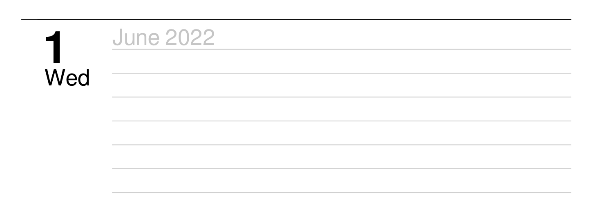

# Python Planner

After searching for a PDF weekly planner for my iPad I decided to try and create one with python. 
Feel free to download the PDF in this repo.

## Options/Settings
There are a few variables early in the code that can be adjusted to change the calendar

|     Variable      | Description                                                                                                   |
|:-----------------:|---------------------------------------------------------------------------------------------------------------|
|       YEAR        | Year to base the planner on                                                                                   |
| include_mini_cal  | Whether to include a calendar of the month in the bottom right corner of each page                            |
| extra_rows_monday | How many extra rows to include for the first day of the week (Monday)                                         |
|   rows_per_day    | How many lines to have in each day. The size of each day is based of the padding variables and the page size. |

## TODO
- If final row of mini calendar is all next month then drop row
- Add Holidays
- If month changes midweek add a label for the new month ie: 

## PDF Library

### Considered
- [pyPdf](http://pybrary.net/pyPdf/pythondoc-pyPdf.pdf.html) - Doesn't seem to have recent documentation 
- PyPDF2 - Contains a class labeled [`PdfFileWriter`](https://pythonhosted.org/PyPDF2/PdfFileWriter.html)
- PyPDF4 - Doesn't appear to have any documentation
- [FPDF](https://pyfpdf.readthedocs.io/en/latest/)
- [ReportLab](https://www.reportlab.com/docs/reportlab-userguide.pdf) - Definitely has ability to create PDFs
- pdfrw - seems to be more based around editing rather than creating
- [PDFMiner](https://pypi.org/project/pdfminer/) - "PDFMiner is a text extraction tool for PDF documents." 

### Decision
I ended up choosing FPDF because it seemed to have the best documentation. 
Was able to perform all desired operations fairly simply with it.